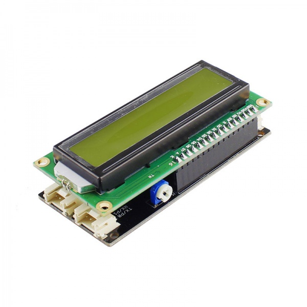

# LCD1602

makecode LCD1602 package for micro:bit  

Author: shaoziyang, Miroslav Suchý  
Date:   2019.Jan

This code is for LCD1602 using shield from Elecrow:

https://www.elecrow.com/lcd1602-display-for-microbit.html

https://www.elecrow.com/wiki/index.php?title=LCD1602_for_microbit_shield



## Add extension

open your microbit makecode project, in Extension, paste  

https://github.com/xsuchy/LCD1602

to search box then search.

## Basic usage

```
let item = 0
LCD1602.LcdInit()
LCD1602.ShowString("Hello", 0, 0)
basic.forever(() => {
    item += 1
    LCD1602.ShowNumber(item, 0, 1)
    basic.pause(1000)
})
```


## API

- LcdInit()  
Initial LCD  

- ShowNumber(n: number, x: number, y: number)  
show a number in LCD at given position.  
n: number will be show  
x: is LCD column position, [0 - 15]  
y: is LCD row position, [0 - 1]  

- ShowString(s: string, x: number, y: number)  
show a string in LCD at given position.  
s: string will be show  
x: is LCD column position, [0 - 15]  
y: is LCD row position, [0 - 1]  

- on()  
turn on LCD  

- off()  
turn off LCD  

- clear()  
clear LCD content  

- shl()
shift left screen

- shr()
shift right screen


## Demo


## License

MIT

Based on https://github.com/makecode-extensions/i2cLCD1602

## Supported targets

* for PXT/microbit


